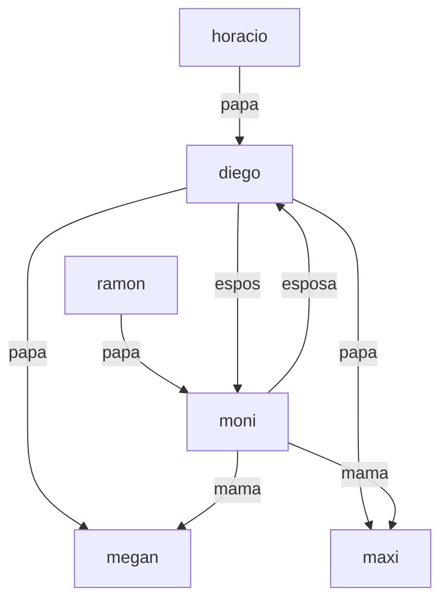

# TinyGraphDB

Similar to TinyVector, this graph db runs in a lambda function and other data store, perhaps DynamoDB or S3.

```mermaid
graph TD
  horacio --papa--> diego
  diego --papa--> megan
  diego --papa--> maxi
  ramon --papa--> moni
  moni --mama--> megan
  moni --mama--> maxi
  diego --esposo--> moni
  moni --esposa--> diego
```